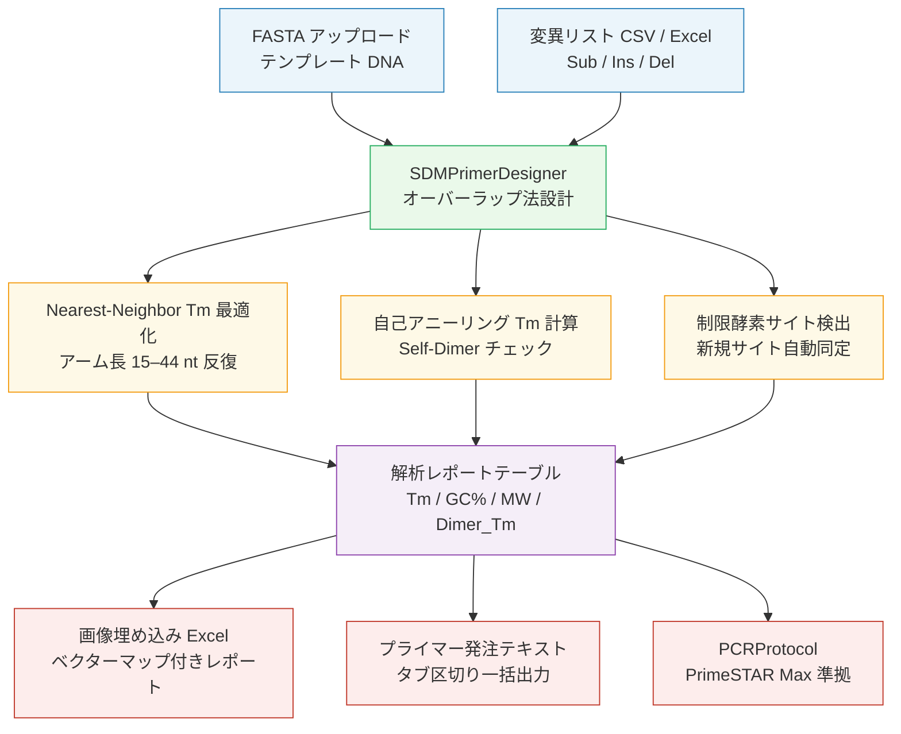

# SDM Primer Designer

部位特異的変異導入（Site-Directed Mutagenesis）のプライマー設計から PCR プロトコル生成まで、ウェットラボの定型作業を一貫して自動化する Streamlit Web アプリ。

---

## 解決した課題

SDM（部位特異的変異導入）は分子生物学の標準的な変異導入手法だが、プライマー設計は意外と手間がかかる。

変異部位の正確な中央配置、Nearest-Neighbor 法による Tm の手計算、GC 含量の確認、自己アニーリングの確認、制限酵素サイト変化の確認——これらをスプレッドシートで管理しながら複数変異を並行設計すると計算ミスが起きやすく、プライマー発注フォームへの転記でもヒューマンエラーが生じる。到着後の溶解計算と PCR プロトコル準備まで含めると、実験着手前の「前準備」に相当な時間がかかる。

本ツールは FASTA と CSV を渡すだけで全ステップを一括自動処理し、Excel レポート・発注用テキスト・PCR プロトコルを即出力する。ウェットラボ研究者が「コードを書き始めた最初の一歩」として開発した作品であり、自分が実験で実際に困った問題の解決から出発している。

---

## 主要機能

- **変異プライマー自動設計** — Sub / Ins / Del の全変異モードに対応。変異部位を中央配置しながらアーム長を 15〜44 nt で反復拡張し、Nearest-Neighbor 法による Tm が目標値（デフォルト 68℃）に達するまで自動最適化。自己アニーリング Tm（Self-Dimer Tm）を全シフト位置で算出し PCR 阻害リスクをテーブル色付きで警告
- **インタラクティブなベクターマップ可視化** — `dna_features_viewer` による Linear / Circular 切り替え表示。AmpR / ori / プロモーターの標準パーツに加え、GFP・各種タグなどのカスタムパーツを JSON で登録・管理可能
- **画像埋め込み Excel レポート** — Tm / GC% / MW / Dimer_Tm・制限酵素サイト変化・ベクターマップ画像を一枚のシートに統合出力。表示モード（Linear / Circular）に連動して行高さを自動調整
- **プライマー発注用一括テキスト出力** — IDT・ユーロフィン等の発注フォームにそのまま貼り付け可能なタブ区切り形式。到着後の 100 μM ストック液調製に必要な溶媒量（nmol → TE μL 換算）も自動計算
- **PrimeSTAR Max 準拠 PCR プロトコル自動生成** — 産物サイズから伸長時間（5 sec/kb）・Wallace Tm からアニーリング時間（5 or 15 sec）を自動算出。反応液組成・サイクリング条件・鋳型量ガイド・トラブルシューティング表を変異ごとに個別出力、全変異一括 `.txt` ダウンロード対応

---

## Live Demo

Streamlit Cloud にデプロイ済みのため、インストール不要で動作確認できます。

🚀 **[Live Demo](https://sdm-primer-designer-rpwh6mccugjtq28uzwawyo.streamlit.app/)**

事前に `examples/template.fasta` と `examples/mutations.csv` をリポジトリからダウンロードし Live Demo にアップロードすると、3 変異（置換・挿入・欠失）のプライマー設計と PCR プロトコル生成を確認できます。

---

## 技術スタック

| カテゴリ | 使用技術 |
|---|---|
| コア計算 | Biopython — `Tm_NN`（Nearest-Neighbor 熱力学パラメータ）、`Restriction`（制限酵素解析）、`SeqIO`、`molecular_weight` |
| 可視化 | dna_features_viewer（ベクターマップ Linear / Circular）、Matplotlib |
| レポート出力 | Pandas、XlsxWriter（画像埋め込み Excel） |
| Web UI | Streamlit（session_state 管理、サイドバー入力） |
| 言語 | Python 3.11+ |

---

## アーキテクチャ



### ファイル別役割

| ファイル | 役割 |
|---|---|
| `sdm_designer.py` | コアエンジン（UI 依存ゼロ）: `SDMPrimerDesigner`（プライマー設計・特徴検出・Tm 計算）、`PCRProtocol` dataclass（プロトコル自動算出） |
| `main.py` | Streamlit UI: ファイルアップロード・結果表示・Excel 生成・プロトコルタブ管理 |
| `examples/` | サンプル入力ファイル（`template.fasta` / `mutations.csv`） |

---

## 使用方法

### セットアップ

```bash
git clone https://github.com/TSUBAKI0531/SDM-Primer-Designer.git
cd SDM-Primer-Designer
pip install -r requirements.txt
streamlit run main.py
# → http://localhost:8501
```

### クイックテスト（サンプルファイル）

1. サイドバーの **FASTA ファイル** に `examples/template.fasta` をアップロード
2. **変異リスト** に `examples/mutations.csv` をアップロード（置換・挿入・欠失の 3 変異）
3. **「🚀 プライマー設計と全解析を実行」** をクリック
4. 解析レポートテーブルで Tm / GC% / Dimer_Tm を確認し、Excel レポートをダウンロード
5. 「📝 PCR プロトコル」タブで PrimeSTAR Max 準拠のプロトコルを確認

---

## 設計上の工夫

**Nearest-Neighbor 法による Tm 計算**
Biopython の `Tm_NN()` を使い Nearest-Neighbor 熱力学パラメータで Tm を算出。GC リッチ・AT リッチな配列でもウォレス則より正確な Tm 推定が可能。PCR プロトコル出力時のアニーリング時間判定（Wallace Tm ≥ 55℃ → 5 sec）と使い分け、精度と実用性を両立している。

**自己アニーリング Tm によるリスク評価**
`_calculate_self_dimer_tm()` は全オーバーラップシフト位置で NN Tm を計算し最大値を返す。50℃以上を赤・40〜50℃をオレンジでテーブルハイライトし、PCR 阻害リスクを設計段階で可視化する。

**2 レイヤー設計（コアエンジン分離）**
`sdm_designer.py` は Streamlit を一切 import しない純粋な計算エンジン。`PCRProtocol` dataclass が `__post_init__` で伸長時間・アニーリング時間・水量を自動算出し、`main.py` は UI とデータの橋渡しのみを担当する。

**画像埋め込み Excel の動的レイアウト**
`xlsxwriter` の `insert_image()` でベクターマップ PNG（BytesIO）を各行に直接埋め込み。Circular 表示（行高 180px）と Linear 表示（行高 80px）を動的に切り替え、ダウンロードした Excel での視認性を確保する。

---

## 今後の拡張可能性

- **宿主別コドン最適化** — 現在は大腸菌最適コドンテーブルを内蔵。酵母・CHO 細胞など宿主別テーブルをサイドバーから選択できるよう拡張可能
- **コンビナトリアル変異設計** — 同一部位への複数アミノ酸置換を並行設計し、スクリーニング用プライマーセットを一括出力
- **シーケンス検証支援** — 変異導入後のサンガーシーケンスデータとの自動アラインメントで成功 / 失敗を判定

---

## ライセンス

MIT License

---

## Author

GitHub: [@TSUBAKI0531](https://github.com/TSUBAKI0531)
